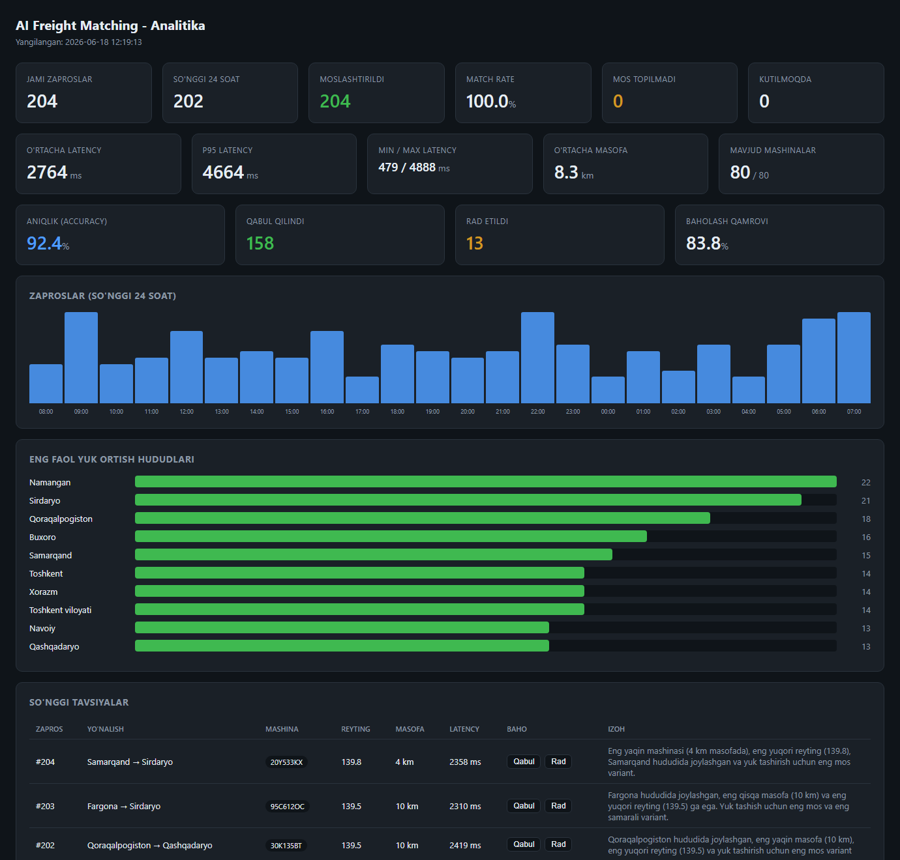
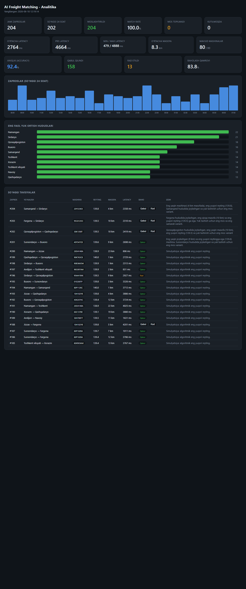

# Track Analytics — AI Yuk Tashish Matching Tizimi

Yuk tashish sohasida zaproslarni avtomatik ravishda eng mos transport vositasi bilan
moslashtiruvchi AI agent tizimi. Agent yuk ortish joyiga eng yaqin yoki shu hududda
turgan mashinani aniqlaydi va zapros yaratilgan zahoti tavsiya beradi. Tavsiya berish
vaqti (latency) va aniqlik (accuracy) real vaqtda monitoring qilinadi.



## Asosiy imkoniyatlar

- **Avtomatik zapros generatori** — har 1-6 daqiqada yangi zapros (kuniga 400+).
- **Gibrid AI agent** — algoritmik tanlov (hudud + GPS Haversine masofa) bilan
  eng mos 3-5 nomzodni topadi, soraj LLM (Claude Haiku 4.5) ulardan eng yaxshisini
  tanlab izoh beradi.
- **Latency monitoring** — har bir tavsiya uchun zapros yaratilgan va tavsiya berilgan
  vaqt orasidagi kechikish saqlanadi.
- **Feedback / accuracy tracking** — dispetcher har bir tavsiyani "Qabul" yoki "Rad"
  qiladi; tizim aniqlik foizini hisoblaydi.
- **Analitika dashboard** — zaproslar, latency, aniqlik, hududlar va so'nggi
  tavsiyalar bitta sahifada.
- **Fallback** — LLM ishlamasa, algoritmik eng yuqori reytingli mashina tanlanadi,
  shu sababli birorta zapros javobsiz qolmaydi.

## Texnologiyalar

| Qatlam | Texnologiya |
|--------|-------------|
| Backend | Django 5 (Python) |
| Ma'lumotlar bazasi | PostgreSQL |
| Navbat / fon vazifalar | Celery + Redis |
| LLM | OpenRouter (`anthropic/claude-haiku-4.5`, OpenAI-mos API) |
| Deploy | Docker Compose |

## Arxitektura

```
Generator (Celery Beat)
   │  har 1-6 daqiqada
   ▼
zaproslar ──► AI Agent (Celery worker)
                  │ 1. Algoritmik shortlist (hudud tier + GPS Haversine)
                  │ 2. LLM tanlov (OpenRouter Haiku 4.5) + izoh
                  │ 3. Fallback agar LLM xato bersa
                  ▼
            agent_takliflari (tavsiya + latency + feedback)
                  ▼
            Analitika dashboard (/)
```

## Ma'lumotlar bazasi

Uchta jadval (har biri alohida migration):

**zaproslar** — yuk tashish so'rovlari
`id`, `yuk_ortish_joyi`, `yuk_ortish_lat`, `yuk_ortish_lng`, `yuk_tushirish_joyi`,
`yuklash_sanasi`, `status`, `created_at`, `updated_at`

**malumotlar** — transport vositalari reestri
`id`, `mashina_raqami`, `joriy_hudud`, `joriy_lat`, `joriy_lng`, `is_available`,
`created_at`, `updated_at`

**agent_takliflari** — agent tavsiyalari logi
`id`, `zapros_id` (FK), `mashina_id` (FK), `reyting_ball`, `masofa_km`, `agent_izohi`,
`zapros_yaratilgan_vaqti`, `agent_taklif_bergan_vaqti`, `latency_ms`, `feedback`,
`feedback_at`, `created_at`, `updated_at`

## AI Agent qanday ishlaydi

1. Yangi zapros yaratilishini kuzatadi.
2. `yuk_ortish_joyi` ni aniqlaydi.
3. `malumotlar` dan mavjud mashinalarni reytinglaydi:
   - bir hududda = eng yuqori ball
   - qo'shni hududda = o'rta ball
   - uzoqda = past ball
   - + GPS Haversine masofasi bo'yicha qo'shimcha ball
4. Eng yaxshi 3-5 nomzodni LLM ga beradi; LLM bittasini tanlab izoh yozadi.
5. Natijani `agent_takliflari` ga yozadi va latency ni hisoblaydi.

## O'rnatish (Docker — tavsiya etiladi)

```bash
cp .env.example .env
# .env ichida OPENROUTER_API_KEY ni qo'ying
docker compose up --build -d
```

Migration avtomatik bajariladi. So'ngra demo ma'lumotlarni yuklang:

```bash
docker compose exec web python manage.py seed_vehicles --count 80
docker compose exec web python manage.py seed_requests --count 200 --match
docker compose exec web python manage.py simulate_feedback
```

Jonli generatorni ishga tushiring (worker va beat allaqachon ishlaydi):

```bash
docker compose exec web python manage.py start_generator
```

Dashboard: **http://localhost:8000/**
Admin panel: **http://localhost:8000/admin/** (`createsuperuser` kerak)

> Eslatma: agar hostda Postgres 5432-portni band qilgan bo'lsa, Docker DB 5433-portda
> ochiladi (ichki servislar `db` hostnomi orqali ulanadi, port ahamiyatsiz).

## O'rnatish (Docker'siz)

Postgres va Redis lokal ishlab turishi kerak.

```bash
python -m venv .venv && .venv\Scripts\activate
pip install -r requirements.txt
cp .env.example .env
python manage.py migrate
python manage.py seed_vehicles --count 80
python manage.py seed_requests --count 200 --match
python manage.py runserver
```

Worker va beat (alohida terminallar):

```bash
celery -A config worker -l info
celery -A config beat -l info --scheduler django_celery_beat.schedulers:DatabaseScheduler
```

## Boshqaruv buyruqlari

| Buyruq | Vazifa |
|--------|--------|
| `seed_vehicles --count N` | N ta tasodifiy mashina yaratadi |
| `seed_requests --count N --match` | N ta zapros + algoritmik moslashtirish (LLM'siz) |
| `generate_live --count N` | N ta yangi zaprosni real LLM agent bilan moslashtiradi |
| `start_generator` | Jonli self-rescheduling generatorni ishga tushiradi |
| `simulate_feedback` | Mavjud tavsiyalarga feedback simulyatsiya qiladi |

## Analitika dashboard

Dashboard zaproslar, latency, aniqlik, hududlar va so'nggi tavsiyalarni ko'rsatadi.
So'nggi tavsiyalar jadvalida har bir tavsiyani **Qabul** / **Rad** tugmalari orqali
baholash mumkin — bu accuracy foizini yangilaydi.



## Testlar

Postgres talab qilinmaydi (in-memory SQLite):

```bash
python manage.py test --settings=config.test_settings
```

## Sozlamalar (.env)

| O'zgaruvchi | Tavsif | Default |
|-------------|--------|---------|
| `OPENROUTER_API_KEY` | OpenRouter API kaliti | - |
| `LLM_BASE_URL` | OpenAI-mos endpoint | `https://openrouter.ai/api/v1` |
| `MATCHER_MODEL` | OpenRouter model slug | `anthropic/claude-haiku-4.5` |
| `MATCHER_SHORTLIST_SIZE` | Nechta nomzod LLM ga beriladi | `5` |
| `GENERATOR_MIN_MINUTES` | Generator min interval | `1` |
| `GENERATOR_MAX_MINUTES` | Generator max interval | `6` |

## Loyiha tuzilishi

```
freight_matcher/
├── config/            settings · celery · urls · test/demo settings
├── matching/
│   ├── models.py      zaproslar · malumotlar · agent_takliflari
│   ├── regions.py     14 O'zbekiston viloyati + GPS + qo'shnilik
│   ├── views.py       analitika dashboard + feedback endpoint
│   ├── services/
│   │   ├── geo.py     Haversine + gibrid reyting
│   │   └── matcher.py shortlist → LLM tanlov → log (fallback bilan)
│   ├── tasks.py       Celery generator + matcher
│   ├── management/    seed_vehicles · seed_requests · generate_live · ...
│   └── templates/     dashboard.html
├── docs/screenshots/  README rasmlari
├── Dockerfile · docker-compose.yml
└── requirements.txt
```

## Spetsifikatsiyadan ataylab qilingan farqlar

Quyidagi ikki yechim mijoz uchun qiymatni oshirish maqsadida ataylab tanlangan:

1. **Lokatsiya modeli.** Dastlabki brief'da `malumotlar` jadvali uchun `joriy_lokatsiya`
   ustuni korsatilgan. Buning ornida gibrid model ishlatildi: `joriy_hudud` (viloyat
   nomi) + `joriy_lat` / `joriy_lng` (GPS). Bu Haversine masofa hisoblash va aniqroq
   "eng yaqin mashina" tanlovini beradi. Brief'dagi "viloyat, shahar yoki GPS koordinata"
   talabini toliq qoplaydi.

2. **Generator intervali.** Brief'da bir vaqtning ozida "1-10 daqiqa interval" va
   "kuniga kamida 400 ta zapros" korsatilgan. Bu ikkisi matematik jihatdan ziddir:
   1-10 daqiqa ortacha 5.5 daqiqa = kuniga ~260 ta (400 dan kam). 400+ talabini
   bajarish uchun default interval **1-6 daqiqa** qilib belgilandi (ortacha ~3.5 daqiqa
   = kuniga ~411 ta). Interval `.env` orqali ozgartiriladi.
